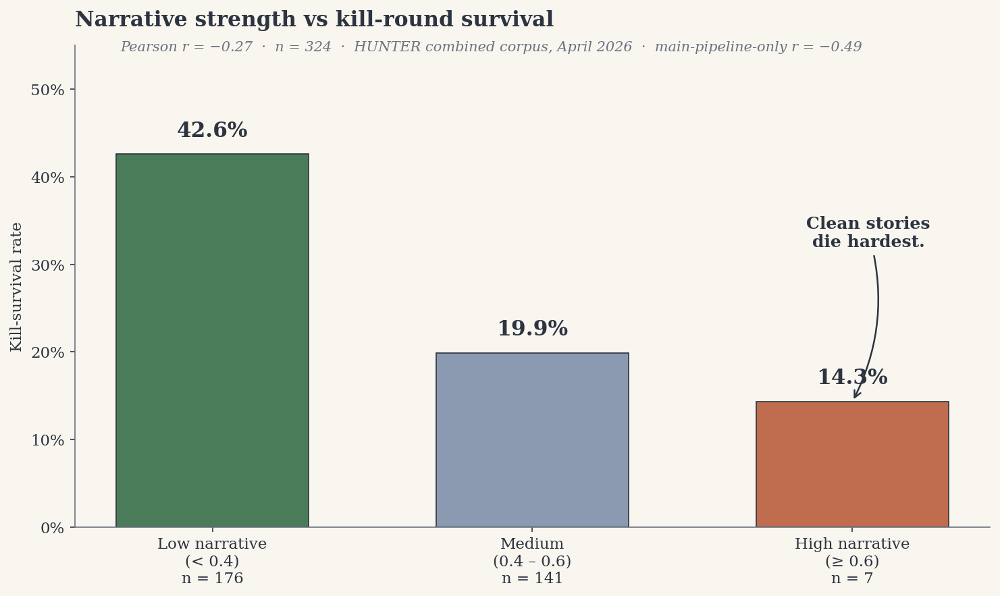

# HUNTER Ledger — Launch Post (Draft 2)

---

## Title options

**A. The First Thing HUNTER Told Me** ← *recommended*
**B. Good Stories Die First**
**C. What I Found After Six Months of Reading Across Finance's Silos**

**Why A.** For a first post on a new Substack, the title has two jobs: give a non-subscriber a reason to click, and set up a serial. "The First Thing HUNTER Told Me" does both — it promises a specific piece of content (*the first thing*), and it implies there will be a second and third thing (*told me*, past tense, there is more). B is more provocative and I almost recommended it, but it gives the punchline away and boxes the post to one beat. C is the safe explainer and won't bang.

## Subtitle options

**A.** ← *recommended* — Field notes from month six of an autonomous cross-silo research instrument. A finding I'd predicted the opposite of, a closed loop through six professions, and a scoreboard that starts filling on June 1.
**B.** A Thursday in April, a minus-sign where I'd expected a plus-sign, and the commitment that either vindicates this project or buries it in public.
**C.** Launching The HUNTER Ledger. One operator, one instrument, one public scoreboard.

**Why A.** Three specific promises in one sentence, each one a different beat of the post. A methodologically serious reader sees "pre-registered" in the structure; a general reader sees "closed loop through six professions" and wants to know what that means. B is more literary but only covers one beat. C is what the About page subtitle should say, not this one.

---

# The First Thing HUNTER Told Me

*Field notes from month six of an autonomous cross-silo research instrument. A finding I'd predicted the opposite of, a closed loop through six professions, and a scoreboard that starts filling on June 1.*

---

It was a Thursday afternoon in April. I was at the kitchen table, laptop open, running on tea.

HUNTER had been alive for six months by then. I'd accumulated enough output — three hundred and twenty-four hypotheses through the full adversarial kill phase across two pipeline iterations, each one scored on six dimensions, each one carrying a resolution date — that I was ready to stop feeding it and start asking it questions about its own work.

The question I had that afternoon was small. I wanted to check one of my own predictions.

Months earlier, when I had been designing the scoring system, I'd added a measurement called *narrative strength*. Every hypothesis got a score from zero to one on whether it read like a clean story — protagonist, catalyst, complication, resolution — or like a tangle of technical notes. I had added this because I had a theory. The hypotheses with clean stories ought to survive the kill rounds longer. A good narrative is a grip. It's what lets a claim stay memorable under pressure. I expected a positive correlation between narrative strength and kill survival. Maybe a strong one.

I opened a new terminal. Wrote a small script. Pulled narrative scores and survival outcomes into two arrays. Asked Python for the Pearson correlation between them.

On the sixty-one most recent hypotheses — the ones from the current upgraded pipeline, the ones with mechanism-kill turned on — I got **r = −0.49**.

I ran it again. Same number.

Strong-narrative hypotheses had died *more* often under the kill rounds. Not less. The ones that scored highest for storytelling — clean arc, clear villain, memorable catalyst — died almost every time. The ones that scored lowest, the awkward ones that take ten pages to explain and that you'd never tell at a dinner party, survived most of the time.

So I ran it on the full 324. All of them. Both pipeline tiers. The combined correlation came back at **r = −0.27**. Weaker than −0.49, same sign. Still statistically serious — a permutation test over 10,000 shuffles returns *p* < 0.00001.

I stared at the screen for a minute. Made another tea. Sat down to figure out what had just happened.

A serious reader should pause on that chart. The high-narrative bin is only seven hypotheses. If two of those seven had gone the other way, the headline would soften considerably. The workhorse of the correlation is really the drop from 42.6% to 19.9% across the two larger bins, n = 176 and n = 141, and that's the part that would survive even if the high-narrative tail were removed entirely.

There is also a second fact on the chart worth naming. The −0.49 number I got first was measured only on the upgraded pipeline — the tier where each hypothesis has to name the specific filing, database, or workflow through which the output of one silo becomes an input to another. On the older pipeline, which didn't apply that test, the same correlation came in at only −0.23, about half as strong. That isn't noise. It tells me something about *which* kill round is doing the work. I'll come back to it in a moment.

So: the sign is flipped from what I predicted. The magnitude is softer on the pooled sample than on the upgraded-pipeline subset alone. Both of those are true and both of them belong in the same paragraph.

It took me three days to sit with the number. When I understood it, it reframed the whole project.

---

## Welcome to The Ledger

This is the first post on *The HUNTER Ledger*. A fair question is *what is this*, and a fair answer is: the [About page](#about) walks you through what HUNTER is and how it works. The short version, for this post: it's a Python program I've been building alone since last November, reading across eighteen corners of finance that nobody reads together, trying to find combinations of facts that imply something specific about a price, and adversarially hunting the surviving combinations for ways to destroy them before calling them useful. It's been running for six months. On June 1 it begins a twelve-week pre-registered study whose rules are already locked.

The Ledger is where I'll write about all of it. Methodology most weeks. Field notes when something surprises me. Ledger entries whenever a prediction resolves. Losses without soft-focus.

I wanted the first post to do something an introduction can't. I wanted it to show you, concretely, what this newsletter is going to be like. So here are three specific things HUNTER has found in its first six months. One I had predicted the exact opposite of. One is a shape in the data I didn't know was there. And one is a commitment — already locked, already timestamped — about what happens in ten weeks and what follows.

---

## I. Good stories die first

Back to the Thursday afternoon, because it's the cleanest of the three findings and it took me the longest to understand.

Here's the pattern I had expected. A cross-silo hypothesis is, by construction, a fragile thing. It argues — often awkwardly — that a specific combination of facts from different corners of finance implies something specific about a price. Any one of the underlying facts might be wrong. The transmission pathway from one silo into the next might not exist the way you claim. The combination might already be published and already priced in. The trade direction might be inverted. There are many ways for one of these things to die.

Against all of that, a clean story should be an advantage. A hypothesis you can tell in one paragraph — with a villain, a catalyst, a date — is memorable. You can point at the shape of it when someone attacks. Strong narrative, I thought, equals durable claim. That was the prior.

What HUNTER showed me was the exact opposite. The hypotheses with the cleanest narratives were the ones the adversarial kill rounds destroyed first. The ones that survived were structural, awkward, full of jargon, impossible to pitch to anyone who wasn't already holding four of the relevant silos in their head.

It took me a while to see why. The moment it clicked was when I realised the kill rounds do their work by *web-searching*. Each round tries to find counter-evidence. Competitor claims. Rebuttals. Papers that already make the argument. Blog posts. Analyst notes. A real adversarial reviewer with access to Google and a reason to destroy the claim.

And a clean narrative is exactly what a web search can find.

If a cross-silo thesis has a protagonist and a villain and a clean arc, someone has already written that story. Probably several someones. Which means the kill round finds the counter-article. The story is a *fingerprint*. It tells you the thesis is already in circulation, which means the market has already reacted to it, which means the edge is gone.

The theses that survive are the ones nobody has written yet. They take ten pages to explain because four of those pages are teaching the reader the vocabulary of the four silos the thesis draws on. They are awkward because they live in a space no single professional community has colonised. Nobody has written the clean version of these stories because no single person has had access to all the silos they require. So the stories stay unwritten. The corrections never get published. The edge stays.

Weak narrative, in other words, is a *proxy for structural opacity*. It's evidence that the claim exists somewhere the market's narrative apparatus hasn't reached. And the narrative apparatus — analyst reports, business press, academic literature, sell-side research — is exactly what Shleifer and Vishny taught us is the channel through which mispricings get corrected.

If a story hasn't been written, there is nothing for the market to read. Nothing to drive correction. The mispricing stays exactly where HUNTER found it.

This is also where the pipeline-tier split becomes interesting rather than embarrassing. The older pipeline's kill rounds asked whether the claim was factually wrong, whether a competitor had already published it, whether a structural barrier made it un-tradeable. The upgraded pipeline asks all of that and then adds a fourth round: for each causal arrow you're claiming, name the specific filing, database, or workflow through which the output of system A enters the input of system B. If you can't name the pathway, the arrow is broken and the whole hypothesis fails. That's the round with the web search. That's the round that penalises clean stories. And that's precisely where the correlation roughly doubles from −0.23 to −0.49. The mechanism-kill round is the specific channel through which narrative clarity becomes a liability, because clean narratives produce findable counter-evidence at named institutions and awkward ones don't.

I would not have reached this conclusion by sitting in a chair and thinking. I reached it because I had built an instrument that disagreed with me, logged the disagreement, and then — when I extended the analysis to a larger sample — told me *which part of itself* was doing the disagreeing. The instrument made me sharper than I was when I started. That, I think, is what instruments are for.

---

## II. A closed loop through six professions

A few weeks after the narrative finding, HUNTER produced something else. Not a hypothesis this time. A *shape*.

Quietly, in the background, while the rest of the pipeline runs, HUNTER builds a causal graph. Every fact it reads, it extracts the cause-and-effect arrows implicit in that fact. *COMEX silver inventory drawdown → photovoltaic manufacturing silver cost rises.* *NAIC reserve methodology update → life insurer statutory capital ratio shifts.* *OSHA silica exposure-limit reduction → Cleveland-Cliffs blast-furnace compliance cost rises.*

These arrows accumulate. Over six months, across all 324 hypotheses and the 12,030 raw facts beneath them, the graph grew to one hundred and seventy-one directed edges connecting more than eleven thousand distinct entities across eighteen silos.

Every so often I run a small algorithm over it. The algorithm is called Tarjan's strongly-connected-components, and what it does — in plain English — is find closed loops in directed graphs. Paths that start somewhere, walk through a sequence of other nodes, and end up back at the starting node.

It found nine of them.

The strongest loop had six nodes. It looked like this:

Six professional domains. Six different academic literatures. Six populations of specialists who almost never read each other's output. And a *closed loop* of causal arrows running through every one of them.

Every arrow in the loop had a specific, nameable transmission pathway. I can cite filenames. Appraised property values flow directly into CMBS servicer loan-level databases through Morningstar and DBRS surveillance products. CMBS loan-level performance feeds bond portfolio managers through Intex analytics. NAIC IRIS filings distribute insurance capital ratios into the corporate credit rating models that structured-finance desks then use to price the next generation of loans. Every edge in the diagram is traceable to a specific data feed, filing standard, or software product. The loop is not an abstraction.

Here is why a closed loop in a causal graph is a particular kind of problem.

An error that enters at one node gets used as *input* by the next node. That node runs its calculation and produces output. The output feeds the next node, which treats the original error as if it were corroborated ground truth and produces its own output. Which feeds the next. Which arrives, eventually, back at the first node — with the original error still embedded, now confirmed by having passed through five other professional communities that each treated it as ratified.

Economists have a word for this when it happens socially. *Echo chamber*. We use the word loosely, the way you might describe a crowd. What HUNTER gives you is the actual circuit diagram. You can point at each node. Every edge has a name. The loop closes in a specific, drawable, mechanical way.

All nine loops HUNTER has detected in the current corpus share a technical property. The rate at which each loop reinforces its own outputs is greater than or equal to the rate at which external evidence corrects it. In Markov-chain terms these are *absorbing states*. They do not decay toward truth. They settle into the wrong answer and they stay there.

Whether the market eventually re-prices these loops — whether any of them is actually *tradeable* versus merely observable — is a different question. That is the third thing.

---

## III. The scoreboard

Everything above is a pattern in a frozen dataset — 12,030 facts, 324 hypotheses, 171 causal edges, nine detected loops, all of it published. I've measured things. I've published the measurements. The data is on Zenodo, the code is on GitHub. That's useful. It isn't proof.

What would be proof is if HUNTER, running forward in time, could identify cross-silo mispricings in advance, post them publicly with resolution dates, and be right more often than chance.

Starting June 1, that's what this Substack is going to be a record of.

The setup is locked already. There's a pre-registration manifest in the GitHub repository — a file called `preregistration.json` — with a SHA-256 hash of `f39d2f5ff6b3e695`. It was locked on April 19. The corpus is frozen at March 31. The code state is frozen. Three null baselines are committed in advance: random-pair, within-silo, shuffled-label. The primary pre-registered test is a specific ordering of compositional-depth strata, with a specific statistical threshold, decided in advance. If HUNTER's output fails the primary test, I've committed in writing — in the manifest, on GitHub — to publishing the null result.

Between June 1 and August 31, HUNTER runs prospectively against the frozen corpus. Hypotheses that clear the diamond threshold get posted on the public prediction board with asset name, direction, and resolution date. First resolutions around mid-July. By late August the ledger either shows the instrument can do what it claims, or shows that it can't. In September one of two papers goes up on SSRN. There is no third option.

I want to be explicit about why I'm locking it this way.

An earlier internal pilot of HUNTER — one I call "v3 Golden" — produced the *opposite* of what the primary hypothesis predicts. The deepest cross-silo compositions underperformed the simpler ones. That pilot ran with the kill phase's live web search *disabled*, which happens to be the specific channel through which cross-silo advantages are supposed to differentiate themselves. The summer run has web-searched mechanism kills turned on. If the summer also inverts, the framework needs structural revision, not recalibration, and I've committed in advance — now, publicly, in the manifest — to saying so.

I'm one person. I built this alone. Those are reasons to be sceptical, and if you want to be, I can only point out that everything is on GitHub and Zenodo and you are genuinely free to argue with me using my own data. What I've tried to do, instead of waiting to be caught, is publish my own weaknesses first. The framework's most specific quantitative prediction — how fast compositional value decays as you add more silos to a hypothesis — is contradicted by HUNTER's own data. The theory said the decay rate should be around 0.27. The data says it's closer to 0.94. The decay is much shallower than the framework claimed. And it fails the same way in both pipeline tiers independently: an earlier 263-hypothesis run under the older pipeline and the current 61-hypothesis run under the upgraded one both produce the shallow-decay pattern, which rules out "the pipeline did something weird" as an explanation. The refutation replicates across 324 hypotheses, not 61. I published that self-refutation in the repository on purpose. I would rather be the person who finds the hole than the person who gets caught not seeing it.

---

## What this Substack is going to be

Weekly posts between now and June 1. Mostly methodology notes and field reports. The engineering story of why the current version of HUNTER finds *fewer* hypotheses than its predecessor and why I think that's the right direction of travel. The eight recurring structural themes the top-scoring output keeps returning to — commercial-real-estate credit cascades, regulatory-transition timing, benchmark-universe construction lag. The single node in the causal graph — ARGUS Enterprise DCF, a piece of commercial real-estate valuation software — that sits at the centre of nine different cross-silo pathways, and what it means for market structure that a closed-source software default is the highest-centrality node in financial methodology.

After June 1, the content changes. The prediction board fills. I post. Dates pass. Predictions resolve. Some will be wins. Some will be losses. I don't get to hide either.

If the ledger works, what exists at the end of summer is a structured causal map of cross-silo financial reality with a real, dated track record attached. If the ledger doesn't work, what exists at the end of summer is a pre-registered null result about a specific hypothesis, which is also a finding, and also publishable.

Both outcomes are fine. The only outcome that isn't fine is not publishing.

If you've read this far and you're curious, subscribe. If you think it's nonsense, subscribe anyway — the ledger is public, and you can watch it fail in real time. If you think it's real, tell one person.

The fun part starts now.

— John

*John Malpass · University College Dublin · April 2026. Code: [github.com/Johnmalpass/hunter-research](https://github.com/Johnmalpass/hunter-research). Corpus: [10.5281/zenodo.19667567](https://doi.org/10.5281/zenodo.19667567). Board: [johnmalpass.github.io/hunter-research](https://johnmalpass.github.io/hunter-research/).*
