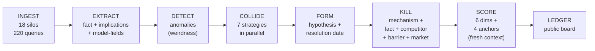

# HUNTER

**An autonomous research engine that reads across 18 professional financial silos and keeps a public, timestamped ledger of what the integration reveals.**

    

---

## What this is

Walk through any big financial firm and you'll see specialists who don't cross-read. The patent lawyer reads USPTO filings. The insurance actuary reads NAIC reserves. The CMBS servicer reads Trepp. None reads the others. So the facts are public, the cross-silo *implication* is private, and only the price shows it. The price is often wrong.

HUNTER is a Python program that reads across all of them at once. It pulls dated facts from 18 silos (patents, SEC filings, NAIC reserves, OSHA actions, CMBS delinquency, Federal Register rules, commodity inventories, analyst targets, academic preprints, pharma approvals, distressed credit, healthcare REITs, energy infrastructure, specialty real estate, government contracts, earnings transcripts, job listings, app rankings), breaks each fact into entities / implications / methodology fields / named causal arrows, looks for pairs that together imply something neither implies alone, runs each pair through a four-round kill gauntlet designed to destroy it, and posts survivors to a public prediction board with an asset, a direction, and a resolution date.

It is also the measurement platform for a pre-registered 12-week empirical study of *compositional alpha*, cross-silo information asymmetries no single specialist captures, running out-of-sample from June 1 through August 31, 2026.

*Compositional alpha* is return that exists only at the join of two or more silos and disappears if you decompose the thesis back into its single-silo components. HUNTER's job is to find it, adversarially kill it when it's false, and publicly log the survivors.

## Status

**Early research.** The pipeline is built and runs. The corpus is frozen. The prediction board is live and empty on purpose: it fills from June 1 as summer hypotheses clear the upgraded three-tier pipeline (Opus 4.7 for the critical reasoning, Sonnet 4.5 for extraction, Haiku 4.5 for ingestion). Zero predictions have resolved as of launch. First resolutions hit the ledger mid-July. The 12-week summer study is the first real out-of-sample run.

Some patterns showed up in the pre-freeze corpus. A hub-and-spoke shape in the methodology graph around ARGUS Enterprise DCF cap-rate assumptions. A hump curve at composition depth 2 that replicates across two independent pipeline iterations. Nine closed Tarjan cycles, every one of them satisfying the stability condition *reinforcement ≥ correction* that the framework predicts. A sharp asymmetry between mechanism-focused and audience-focused kill success. A bimodal distribution of quality scores. A negative correlation between narrative strength and kill survival (r = −0.49, scoped to the n = 61 main-pipeline subset). None of these are claimed as findings. They are held back as hypotheses the summer will test. See `docs/MATH_VERIFICATION.md` for the empirical detail on what the pre-freeze corpus actually supports, refutes, and leaves open.

## Theoretical framework at a glance

The framework is a ten-layer theory of compositional information asymmetry. The first seven layers extend existing literatures (Shannon rate-distortion, Hong–Stein attention, Arrow–Debreu completeness) into the compositional regime. The last three, **epistemic cycles**, **the cycle hierarchy**, and **fractal incompleteness**, are the framework's original contributions.

| # | Layer | Core claim | Pre-freeze status |
|---|---|---|---|
| 1 | Translation Loss | Information degrades at silo boundaries | Cross-silo > within-silo supported (+9.1 pts) |
| 2 | Attention Topology | Autopoietic fixed point; market's infrastructure reorganises to confirm its own beliefs | Hub-and-spoke graph with degree-9 ARGUS hub supports |
| 3 | The Question Gap | Wrong loss function; missing variables the market doesn't know it's missing | 423 negative-inference detections; summer tests |
| 4 | Epistemic Phase Transitions | Discontinuous framework shifts; universality classes | 18 phase-transition signals; not yet tested |
| 5 | Rate-Distortion Bedrock | Shannon floor on compositional residual; novel *interaction-distortion function* | Foundational; no data required |
| 6 | Market Incompleteness | Gödelian trilemma; self-protection property | Conjecture pending collaboration with senior theorist |
| 7 | Depth-Value Distribution | Hump curve, convergent sum | Shape supported (peak at d=2); specific α = 0.27 **refuted** (observed α ≈ 0.94) |
| 8 | Epistemic Cycles ★ | Self-reinforcing closed loops are stable equilibria | All 9 detected cycles satisfy r ≥ c |
| 9 | The Cycle Hierarchy ★ | Higher-dimensional topology (H₀ → H₁ → H₂ → Hₙ) | 2 of 9 taxonomy types observed; rest theoretical |
| 10 | Fractal Incompleteness ★ | Self-similar, computationally intractable structure | Structural claim from combinatorial growth |

★ original contribution. For the complete layer-by-layer argument including the **three walls** that prevent market completion (Verification, Regeneration, Self-Reference), see `docs/HUNTER_THEORY.md`. For every quantitative prediction tested against the frozen corpus, three supported, two refuted, one mixed, see `docs/MATH_VERIFICATION.md`.

## Provenance

This repository is the public release of a six-month private solo build (November 2025 through April 2026). The git history shows a short commit series because the audit trail was never intended to live in git: it lives in the SHA-256-locked pre-registration manifest (`preregistration.json`, code hash `f39d2f5ff6b3e695`, locked 2026-04-19), the timestamped frozen corpus on Zenodo (DOI [10.5281/zenodo.19667567](https://doi.org/10.5281/zenodo.19667567)), and the public, timestamped prediction board. Anyone auditing a claim runs `python run.py preregister check` against the manifest; independent replication runs against the frozen Zenodo corpus and the locked code hash, not against the commit history.

## Corpus reconciliation

Two numbers appear in this repository and they measure different things. **Published corpus: 12,030 facts** (the full ingested set released via Zenodo v1, CC-BY-4.0). **Pre-registration-eligible subset: 8,315 facts** (the subset dated on or before the 2026-03-31 cutoff; facts ingested but dated later are quarantined from the primary test). `preregister.py` hashes the eligible subset's fact IDs and locks the hash in `preregistration.json`. Pre-existing collisions in the database mix pre- and post-cutoff facts and are not used for the primary test; the summer study regenerates collisions from the frozen pre-cutoff subset only. The strata partials currently stored in the manifest (A:5, B:5, C:8, D:25) are provisional counts from pre-regeneration collisions; the locked strata counts will be recomputed on the eligible subset at the start of the summer run.

## A note on the operator

This is built and run by one person: John Malpass, at University College Dublin. The repo is public on purpose: priority of discovery is claimed at the moment of posting, and honest public critique is worth more than private reassurance. Prior-art pointers, design criticism, and replication attempts all welcome. Contact below.

## Key artifacts

- **Corpus (Zenodo, CC-BY-4.0).** 12,030 facts across 18 silos, 77 countries, 30,967 normalised entity-index entries, 11,835 distinct entities, 6,670 model-field extractions, 1,570 detected anomalies, 606 tracked expirations (dated future catalysts), 474 cross-silo collisions, 113 held collisions, 52 multi-link chains, 171 directed causal edges with named transmission pathways, 20 differential-edge records, 12 knowledge-graph nodes, 9 Tarjan cycles, 138 kill-failure topology pairs, 423 negative-inference gap detections, 324 hypotheses with completed adversarial review across two pipeline iterations (263 in `hypotheses_archive` from the earlier run, March 28 – April 3, 2026; 61 in `hypotheses` from the later adversarial-review-upgrade run, April 1–4, 2026), 16 deep-dive expansions on top findings, 45 `findings` at diamond ≥ 65, 61 narrative scores, 61 residual classifications, 18 phase-transition signals, and 1,155 theory-evidence records across 13 framework layers. See `docs/DATA_OVERVIEW.md` for the complete table-by-table catalogue. DOI: [10.5281/zenodo.19667567](https://doi.org/10.5281/zenodo.19667567).
- **Diamond theses catalogue.** `docs/diamond_theses.md`, eighteen pre-freeze diamond-tier hypotheses, grouped into three tiers by adversarial-review score, every one resolvable to a specific row in the Zenodo corpus. Candidates, not findings; the summer tests them.
- **Methods paper (Paper 0, SSRN).** Instrument, pipeline, the novel methodology triad, kill-phase design. Submission pending April 2026.
- **Additional working papers.** Drafts on the mechanism-assembly bottleneck, the formal compositional residual, and the cross-silo composition test ship through summer and autumn. Empirical claims are presented as pre-registered hypotheses until summer replication completes.
- **Prediction board.** Public, timestamped, resolvable. URL: `https://johnmalpass.github.io/hunter-research/`
- **Methodology brief (PDF, 2 pages).** Free, publicly downloadable, linked on the prediction board.
- **Pre-registration manifest.** `preregistration.json`, SHA-256 locked at hash `f39d2f5ff6b3e695`, corpus frozen 2026-03-31, code hash locked 2026-04-19.

## Quick start

```bash
git clone https://github.com/Johnmalpass/hunter-research.git
cd hunter-research
python -m venv .venv && source .venv/bin/activate
pip install -r requirements.txt
cp .env.example .env   # add your API keys

# dashboard (no API required, reads the frozen corpus)
python run.py dashboard

# one-screen state of the system (no API)
python run.py status

# full pipeline (requires API budget; honours the preregistration freeze)
python run.py live

# verify nothing has drifted against the manifest
python run.py preregister check

# run every analyser module against the current corpus (no API)
python run.py analyse
```

Three model tiers are wired up in `config.py`: Opus 4.7 for the critical reasoning stages (mechanism kill, adversarial review), Sonnet 4.5 for standard extraction, Haiku 4.5 for high-volume ingestion. Budgets and throttles live there too.

## Pipeline



Every stage is defined in `prompts.py` (26 LLM prompts, one per step) and routed through `config.py` (18 source types, 153-pair hand-calibrated domain distance matrix, 220 ingest queries). The causal graph, model-field extractions, and adversarial review traces all persist to 52 database tables.

The seven collision strategies run in parallel per anomaly: implication matching, entity matching, keyword matching, model-field matching, causal-graph traversal, embedding similarity, belief-reality contradiction. Matches get blended, evaluated by an LLM, checked against prior publication, and promoted to hypotheses with resolution dates. The kill gauntlet then runs four adversarial rounds (mechanism, fact-check, competitor, barrier) plus a market-check; survivors get scored in a fresh context by an adversarial reviewer against four calibration anchors.

## Causal topology


The pre-freeze methodology graph has **203 nodes, 171 directed edges, a 5-unit gap at degrees 4–8, and a single degree-9 outlier**, ARGUS Enterprise DCF cap-rate assumptions. That's the hub-and-spoke signature the framework's Layer 2 predicts, and it is what a scale-free power law would *not* produce. The concentration is substantively meaningful: a regulator or software vendor that updated ARGUS's default cap-rate assumption would propagate through nine distinct causal pathways simultaneously, each terminating in a different professional silo. See `docs/MATH_VERIFICATION.md` Test 4 for the full degree-distribution analysis and the falsification against scale-free.

## Modules

**Ingestion and extraction.** `hunter.py`, `prompts.py`.

**Matching and collision.** `hunter.py` (CollisionCycle with seven parallel strategies).

**Adversarial kill phase.** Embedded in `hunter.py` with support from `formula_validator.py`, `kill_failure_mapper.py`, and the financial-mechanics check.

**Hypotheses, scoring, ledger.** `hunter.py`, `prediction_board.py`, `portfolio.py`, `portfolio_feedback.py`.

**Analysis and graph.** `cycle_detector.py` (Tarjan SCC), `cycle_chain_detector.py`, `chain_to_causal_edges.py`, `narrative_detector.py`, `obscurity_filter.py`, `halflife_estimator.py`, `reinforcement_measurer.py`, `phase_transition_detector.py`, `adversarial_residual_classifier.py`, `thesis_dedup.py`, `chain_decay_fitter.py`, `residual_tam.py`.

**Self-improvement.** `adversarial_self_test.py`, `self_improve.py`, `moat_tracker.py`, `meta_hunter.py`, `inverse_hunter.py`, `frontier_hypotheses.py`, `belief_decomposer.py`.

**Study infrastructure.** `preregister.py`, `orchestrator.py`, `calibration.py`, `theory_layer.py`, `theory.py`, `theory_canon_v2.py`.

**Dashboards.** `master_dashboard.py` (unified five-tab Streamlit dashboard), `hunter_dashboard.py` and `theory_dashboard.py` (legacy), `public_dashboard.py`.

**Reports and artifacts.** `generate_report.py`, `enrich_thesis.py`, `build_story_pdf.py`, `targeting.py`.

60+ modules, 52 DB tables, 26 LLM prompts.

## Pre-registered summer 2026 study

A 12-week out-of-sample study runs June 1 through August 31, 2026 on the frozen corpus. Manifest locked at SHA-256 `f39d2f5ff6b3e695`.

**Primary test.** Median realised alpha over SPY total return, ordered across four strata by how many distinct silos the hypothesis combines: A (1) ≤ B (2) ≤ C (3) ≤ D (≥4), with D − A > 0 at p < 0.05 under a 10,000-resample paired bootstrap. Strata are fixed in `config.py`.

**Secondary tests.**
- **H2.** Detected cycles (reinforcement ≥ 0.5) persist uncorrected in the market for ≥ 14 days in ≥ 2 of the 9 currently detected cycles.
- **H3.** Cross-silo collisions (domain distance ≥ 0.60) score ≥ 10 points higher than within-silo (< 0.30) on average.
- **H4.** Chain-depth-3 hypotheses outperform chain-depth-1 at Cohen's d ≥ 0.3.

**Null baselines (committed in advance).**
- **B1 random-pair.** Facts drawn from distinct source types at random.
- **B2 within-silo.** Same-source-type pairing forced.
- **B3 shuffled-label.** Source-type labels shuffled before pipeline execution.

**Decision rules** (fixed in `preregistration.json`):
- Primary wins: accept the compositional alpha hypothesis; empirical paper ships.
- Primary loses (D ≤ B or monotonicity violated): reject; null-result paper ships.
- No post-hoc corpus additions. No scoring-weight changes. No primary/secondary swap. No retroactive exclusion. All four strata reported regardless of sign.

**Prior contradictory evidence, and why the study still runs.** An earlier retrospective pilot (the "v3 Golden" validation run, configured by the `V3_GOLDEN_*` constants in `config.py`) produced Stratum D < Stratum B, directly contradicting H1. That pilot ran with `RETROSPECTIVE_DISABLE_WEB_SEARCH = True`, i.e. the kill phase could not check causal mechanisms against live web evidence, which is the specific channel through which cross-silo advantages are supposed to manifest. The summer 2026 study runs prospectively with web-searched mechanism kills, the regime H1 is actually about. If the summer study also produces D ≤ B or violates monotonicity, the manifest's decision rule kicks in: reject H1, ship the null paper, treat the framework as needing structural revision (not recalibration). See `docs/THEORY_CANON.md` §2 claim C4 for the full epistemic state.

Drift during the study is auto-detected by `python run.py preregister check` and reported in the final paper.

Pre-freeze patterns (the mechanism-vs-audience kill asymmetry, the hub-and-spoke methodology graph around ARGUS Enterprise DCF assumptions, the bimodal diamond-score distribution, the narrative-survival correlation r = −0.49, the nine detected Tarjan cycles) are secondary hypotheses for the summer to test. Not findings.

## What this is not

- Not a fund, not a product, not a pitch. Nothing here solicits capital or clients.
- Not a commentary Substack dressed as code. The code is the primary artifact.
- Not a claim of a specific hit rate, return, or market-size opportunity. The ledger establishes track record, starting June 2026.

## How to cite

Corpus:
> Malpass, J. (2026). *HUNTER Cross-Silo Financial Corpus v1 (frozen April 2026)* [Data set]. Zenodo. https://doi.org/10.5281/zenodo.19667567

Instrument / methodology:
> Malpass, J. (2026). *HUNTER: An Autonomous Research Instrument for Cross-Silo Financial Inference* (Working Paper 0). SSRN.

## License

- **Code.** MIT (see `LICENSE`). Use, fork, and run freely.
- **Corpus and derived data.** CC-BY-4.0 (see `LICENSE_DATA`). Redistribute with attribution.
- **Working papers and posts.** CC-BY-4.0 unless marked otherwise.

## Reading order

- **Quick reader.** README, then the methodology brief PDF (`docs/methodology_brief.pdf`).
- **Serious reader.** README → `docs/DATA_OVERVIEW.md` (complete table-by-table inventory) → `docs/HUNTER_THEORY.md` (ten-layer framework, the three walls, the topological hierarchy) → `docs/MATH_VERIFICATION.md` (empirical verification of every quantitative prediction against the frozen corpus; three supported, two refuted, with charts) → `docs/diamond_theses.md` (eighteen top pre-freeze theses, each resolvable to a Zenodo row) → `docs/engineering_evolution.md` (how the instrument changed between old and current pipelines) → `docs/research_themes.md` (eight structural themes HUNTER keeps surfacing) → `docs/EMPIRICAL_FINDINGS.md` (what the pre-freeze data actually said, including the combined 324-hypothesis picture) → `docs/THEORY_CANON.md` (canonical vocabulary and the formally withdrawn overclaims).
- **Replicator.** The above, plus `preregistration.json` with the SHA-locked manifest, plus `python run.py preregister check` against the frozen corpus.

## Contact

Honest critique, prior-art pointers, and replication attempts welcome. No cold pitches, this is a research project.

**John Malpass** · University College Dublin · `johnjosephmalpass@gmail.com`
GitHub: [@Johnmalpass](https://github.com/Johnmalpass) · Substack: *The HUNTER Ledger* (linked in the GitHub About sidebar).
