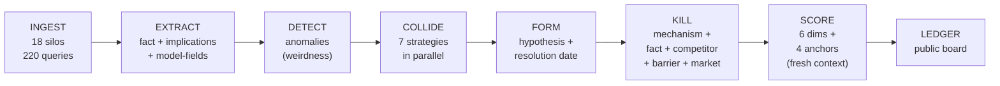

# HUNTER

A Python program that reads across 18 corners of finance at once and keeps a public scoreboard of what it finds.

    

---

## What this is

Walk through any big financial firm and you'll see specialists who don't cross-read. The patent lawyer reads USPTO filings. The insurance actuary reads NAIC reserves. The CMBS servicer reads Trepp. Nobody reads the others. So the facts are public, the combined implication is private, and only the price ever shows it. The price is often wrong.

HUNTER is the program I built to read across all of them.

It pulls dated facts from 18 professional silos. For each fact it notes the entities, the implications for other silos, and the causal arrows the fact implies. Then it looks for pairs of facts from different silos that, taken together, imply a third thing neither implies alone. Each pair runs through four adversarial rounds that try to destroy it. The final round is the hardest: for each causal arrow in the claim, HUNTER has to name the specific filing, database, or workflow through which one silo's output becomes another silo's input. If it can't, the arrow is broken and the claim dies. Survivors get posted on a public prediction board with an asset, a direction, and a resolution date.

It is also the measurement platform for a 12-week pre-registered study starting June 1, 2026. The study tests whether cross-silo compositions produce return that no single silo would show. I have committed in writing to publishing the null result if the study fails.

## Status

Early research. The code runs. The corpus is frozen. The prediction board is live and empty on purpose. It fills from June 1 as summer hypotheses survive the adversarial pipeline. Zero predictions have resolved at launch. First resolutions land mid-July. The summer study is the first real out-of-sample run.

A handful of patterns showed up in the pre-freeze corpus. Some look suggestive. Two are already refuted by HUNTER's own data (and published that way). None is a finding. The summer run is the actual test. `docs/MATH_VERIFICATION.md` has the full detail on what the pre-freeze data supports, refutes, and leaves open.

## Theoretical framework at a glance

The theory behind HUNTER sits in ten layers. The first seven build on Shannon rate-distortion, Hong-Stein attention, and Arrow-Debreu market completeness. The last three are the parts I think are new: epistemic cycles, the cycle hierarchy, and fractal incompleteness.

| # | Layer | Core claim | Pre-freeze status |
|---|---|---|---|
| 1 | Translation Loss | Information degrades at silo boundaries | Cross-silo > within-silo supported (+9.1 pts) |
| 2 | Attention Topology | Autopoietic fixed point; the market reorganises to confirm its own beliefs | Hub-and-spoke graph with degree-9 ARGUS hub supports |
| 3 | The Question Gap | Wrong loss function; missing variables the market doesn't know it's missing | 423 negative-inference detections; summer tests |
| 4 | Epistemic Phase Transitions | Discontinuous framework shifts; universality classes | 18 phase-transition signals; not yet tested |
| 5 | Rate-Distortion Bedrock | Shannon floor on compositional residual | Foundational; no data required |
| 6 | Market Incompleteness | Gödelian trilemma; self-protection property | Conjecture, awaiting senior-theorist collaborator |
| 7 | Depth-Value Distribution | Hump curve, convergent sum | Shape supported (peak at d=2); specific α = 0.27 **refuted** (observed α ≈ 0.94) |
| 8 | Epistemic Cycles ★ | Self-reinforcing closed loops are stable equilibria | All 9 detected cycles satisfy r ≥ c |
| 9 | The Cycle Hierarchy ★ | Higher-dimensional topology (H₀ → H₁ → H₂ → Hₙ) | 2 of 9 taxonomy types observed; rest theoretical |
| 10 | Fractal Incompleteness ★ | Self-similar, computationally intractable structure | Structural claim from combinatorial growth |

★ original. The full argument sits in `docs/HUNTER_THEORY.md`. Every quantitative prediction tested against the frozen corpus sits in `docs/MATH_VERIFICATION.md`. Three supported, two refuted, one mixed.

## Provenance

I built this alone, privately, between November 2025 and April 2026. That's why the public git history is short. The actual audit trail is the pre-registration manifest (hash `f39d2f5ff6b3e695`, locked April 19), the frozen Zenodo corpus (DOI [10.5281/zenodo.19667567](https://doi.org/10.5281/zenodo.19667567)), and the live prediction board. To audit any claim, run `python run.py preregister check` against the manifest. To replicate, run the locked code against the frozen corpus.

## Corpus reconciliation

Two numbers appear in this repository and they measure different things. The **published corpus is 12,030 facts**, the full ingested set released via Zenodo v1. The **pre-registration-eligible subset is 8,315 facts**, the subset dated on or before the 2026-03-31 cutoff. Facts ingested but dated later are quarantined from the primary test. `preregister.py` hashes the eligible subset's fact IDs and locks the hash in `preregistration.json`. The summer study regenerates collisions from the eligible subset only.

## About the operator

I'm John Malpass, an economics student at University College Dublin. I built this alone. The repo is public because public critique is worth more than private reassurance. Prior-art pointers and replication attempts welcome.

## Key artifacts

- **Corpus.** 12,030 facts across 18 silos, 324 hypotheses, 171 causal edges, 9 detected cycles. CC-BY-4.0 on Zenodo at DOI [10.5281/zenodo.19667567](https://doi.org/10.5281/zenodo.19667567). `docs/DATA_OVERVIEW.md` has the full table-by-table breakdown.
- **Diamond theses catalogue.** 18 top-scoring pre-freeze hypotheses, grouped into three tiers. Every ID resolves to a row in the Zenodo corpus. See `docs/diamond_theses.md`. Candidates, not findings.
- **Prediction board.** https://johnmalpass.github.io/hunter-research/
- **Methodology brief.** 2-page PDF at `docs/methodology_brief.pdf`, linked on the prediction board.
- **Pre-registration manifest.** `preregistration.json`, locked at hash `f39d2f5ff6b3e695` on April 19. Corpus frozen March 31.
- **Methods paper.** Paper 0 on SSRN, submission pending.
- **Compositional Information Theory equation.** Working draft at `docs/CIT_EQUATION.md`. A five-factor decomposition of compositional alpha (synergy × conversion × lead time × decay − publication cost). Empirical test pre-registered for the summer study.

## Active-development trading-shop infrastructure (`quant/`)

The `quant/` subpackage is an active-development trading-shop architecture built on top of the HUNTER research engine. It includes a four-state regime detector with a 25-year-fitted Markov forecaster, a predicate DSL with an LLM-driven mechanism compiler, synergy-weighted coalition voting, online Bayesian threshold learning, Kelly position sizing with regime conditioning, an audience translator that produces Substack/SSRN/sell-side/Treasury/Twitter formats from a single thesis, a dialect-KL estimator (the empirical instrument for the Universal Translator Theorem), an articulation-lead-time tracker, three independent compositional-depth metrics (synergistic information, the Maxwell-demon-bound Demon Index, and the Kolmogorov-compression K-Score), a strange-loop self-modeller, a persistent seam network for the Open Compositional Atlas, and a TRADER orchestrator that ties it all together. It is independent of the SHA-locked HUNTER engine and may be modified at any time without affecting the summer-2026 pre-registration manifest. Run `python -m quant doctor` for a one-screen system audit.

## Quick start

```bash
git clone https://github.com/Johnmalpass/hunter-research.git
cd hunter-research
python -m venv .venv && source .venv/bin/activate
pip install -r requirements.txt
cp .env.example .env   # add your API keys

# dashboard (no API required, reads the frozen corpus)
python run.py dashboard

# one-screen state of the system (no API)
python run.py status

# full pipeline (requires API budget; honours the preregistration freeze)
python run.py live

# verify nothing has drifted against the manifest
python run.py preregister check

# run every analyser module against the current corpus (no API)
python run.py analyse
```

Three model tiers are wired up in `config.py`. Opus 4.7 handles the critical reasoning (mechanism kill, adversarial review). Sonnet 4.5 does standard extraction. Haiku 4.5 does high-volume ingestion. Budgets and throttles live in `config.py` too.

## Pipeline



Every pipeline stage lives in `prompts.py` as a specific LLM prompt. Configuration lives in `config.py`. Outputs persist to 52 SQLite tables.

The collision step runs seven matching strategies in parallel: implication match, entity match, keyword match, model-field match, causal-graph traversal, embedding similarity, and belief-reality contradiction. Matches get blended and evaluated. The kill gauntlet then runs four destruction rounds (fact-check, competitor search, barrier search, mechanism check) plus a market-check. Survivors get scored by a fresh-context adversarial reviewer against four calibration anchors.

## Causal topology


The pre-freeze methodology graph has 203 nodes and 171 directed edges. Most nodes have degree 1 or 2. No node has degree 4 through 8. One node has degree 9: ARGUS Enterprise DCF cap-rate assumptions. That's hub-and-spoke, not a power law. If a regulator or software vendor changed ARGUS's default cap-rate, it would propagate through nine different causal pathways at once, each ending in a different professional silo. `docs/MATH_VERIFICATION.md` Test 4 has the full degree-distribution analysis and the falsification against scale-free.

## Modules

**Ingestion and extraction.** `hunter.py`, `prompts.py`.

**Matching and collision.** `hunter.py` (CollisionCycle with seven parallel strategies).

**Adversarial kill phase.** Embedded in `hunter.py`, with support from `formula_validator.py`, `kill_failure_mapper.py`, and the financial-mechanics check.

**Hypotheses, scoring, ledger.** `hunter.py`, `prediction_board.py`, `portfolio.py`, `portfolio_feedback.py`.

**Analysis and graph.** `cycle_detector.py` (Tarjan SCC), `cycle_chain_detector.py`, `chain_to_causal_edges.py`, `narrative_detector.py`, `obscurity_filter.py`, `halflife_estimator.py`, `reinforcement_measurer.py`, `phase_transition_detector.py`, `adversarial_residual_classifier.py`, `thesis_dedup.py`, `chain_decay_fitter.py`, `residual_tam.py`.

**Self-improvement.** `adversarial_self_test.py`, `self_improve.py`, `moat_tracker.py`, `meta_hunter.py`, `inverse_hunter.py`, `frontier_hypotheses.py`, `belief_decomposer.py`.

**Study infrastructure.** `preregister.py`, `orchestrator.py`, `calibration.py`, `theory_layer.py`, `theory.py`, `theory_canon_v2.py`.

**Dashboards.** `master_dashboard.py` (unified five-tab Streamlit dashboard), `hunter_dashboard.py` and `theory_dashboard.py` (legacy), `public_dashboard.py`.

**Reports and artifacts.** `generate_report.py`, `enrich_thesis.py`, `build_story_pdf.py`, `targeting.py`.

60+ modules, 52 DB tables, 26 LLM prompts. The main engine file (`hunter.py`) is documented section by section in `docs/HUNTER_ARCHITECTURE.md`. Read that before opening the file.

## Pre-registered summer 2026 study

A 12-week out-of-sample study runs June 1 through August 31, 2026 against the frozen corpus. Manifest locked at SHA-256 `f39d2f5ff6b3e695`.

**Primary test.** Median realised alpha over SPY total return, ordered across four strata by how many distinct silos the hypothesis combines: A (1) ≤ B (2) ≤ C (3) ≤ D (≥4), with D − A > 0 at p < 0.05 under a 10,000-resample paired bootstrap. Strata are fixed in `config.py`.

**Secondary tests.**
- **H2.** Detected cycles (reinforcement ≥ 0.5) persist uncorrected in the market for ≥ 14 days in ≥ 2 of the 9 currently detected cycles.
- **H3.** Cross-silo collisions (domain distance ≥ 0.60) score ≥ 10 points higher than within-silo (< 0.30) on average.
- **H4.** Chain-depth-3 hypotheses outperform chain-depth-1 at Cohen's d ≥ 0.3.

**Null baselines (committed in advance).**
- **B1 random-pair.** Facts drawn from distinct source types at random.
- **B2 within-silo.** Same-source-type pairing forced.
- **B3 shuffled-label.** Source-type labels shuffled before pipeline execution.

**Decision rules** (fixed in `preregistration.json`):
- Primary wins: accept the compositional alpha hypothesis; empirical paper ships.
- Primary loses (D ≤ B or monotonicity violated): reject; null-result paper ships.
- No post-hoc corpus additions. No scoring-weight changes. No primary-secondary swap. No retroactive exclusion. All four strata reported regardless of sign.

**Prior contradictory evidence, and why the study still runs.** An earlier retrospective pilot ("v3 Golden", configured by the `V3_GOLDEN_*` constants in `config.py`) produced Stratum D < Stratum B, directly contradicting H1. That pilot ran with `RETROSPECTIVE_DISABLE_WEB_SEARCH = True`, which means the kill phase could not check causal mechanisms against live web evidence. That is the exact channel through which cross-silo advantages are supposed to manifest. The summer study runs prospectively with web-searched mechanism kills. If the summer also produces D ≤ B or violates monotonicity, the manifest's decision rule kicks in: reject H1, ship the null paper, treat the framework as needing structural revision rather than recalibration. `docs/THEORY_CANON.md` §2 claim C4 has the full epistemic state.

Drift during the study is auto-detected by `python run.py preregister check` and reported in the final paper.

## What this is not

This isn't a fund, a product, or a pitch. Nothing here solicits capital. The code is the primary artifact. There's no claim of a specific hit rate or return. The ledger starts accumulating track record on June 1.

## How to cite

Corpus:
> Malpass, J. (2026). *HUNTER Cross-Silo Financial Corpus v1 (frozen April 2026)* [Data set]. Zenodo. https://doi.org/10.5281/zenodo.19667567

Instrument / methodology:
> Malpass, J. (2026). *HUNTER: An Autonomous Research Instrument for Cross-Silo Financial Inference* (Working Paper 0). SSRN.

## License

- **Code.** MIT. Use, fork, and run freely. See `LICENSE`.
- **Corpus and derived data.** CC-BY-4.0. Redistribute with attribution. See `LICENSE_DATA`.
- **Working papers and posts.** CC-BY-4.0 unless marked otherwise.

## Reading order

If you want the gist, read this README and the 2-page methodology brief PDF.

If you want the argument, start with `docs/HUNTER_THEORY.md` for the ten layers. Then `docs/MATH_VERIFICATION.md` for what the pre-freeze data actually says about each prediction. Then `docs/diamond_theses.md` for the 18 top-scoring pre-freeze hypotheses. `docs/DATA_OVERVIEW.md` has the table-by-table corpus inventory if you want to dig in.

If you want the inferential framework (identification, power, Bayesian posteriors, multiple-testing correction, robustness specs), read `docs/STATISTICAL_METHODS.md`. The Bayesian re-analysis script `python bayesian_alpha.py` runs the posterior inference against the frozen Zenodo corpus and prints results in under ten seconds.

If you want the unifying equation, read `docs/CIT_EQUATION.md` — a working-draft of the Compositional Information Theory paper. Five-factor decomposition of compositional alpha (synergy × conversion × lead time × decay − publication cost). The four pre-registered tests (CIT-1 through CIT-4) in §6 run against the summer-2026 study.

If you want to replicate, pull the frozen Zenodo corpus, clone this repo, and run `python run.py preregister check` against the locked manifest.

Supporting docs: `docs/engineering_evolution.md` walks through how the pipeline changed between the old and current versions. `docs/research_themes.md` covers the eight recurring structural themes in the top-scoring output. `docs/EMPIRICAL_FINDINGS.md` covers the pre-freeze empirical analysis including the combined 324-hypothesis picture. `docs/THEORY_CANON.md` is the canonical vocabulary plus the formally withdrawn overclaims.

## Contact

Honest critique, prior-art pointers, and replication attempts welcome. No cold pitches. This is a research project.

**John Malpass** · University College Dublin · `johnjosephmalpass@gmail.com`
GitHub: [@Johnmalpass](https://github.com/Johnmalpass) · Substack: *The HUNTER Ledger* (linked in the About sidebar).
