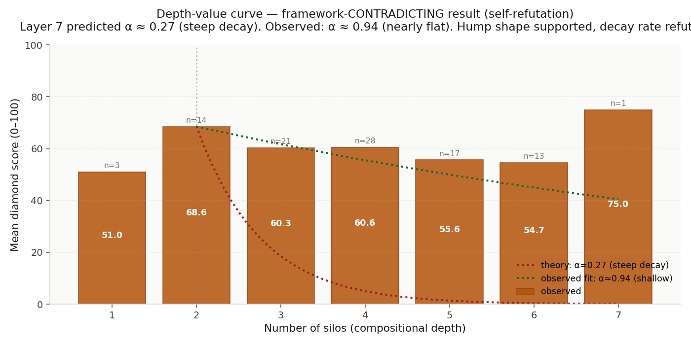
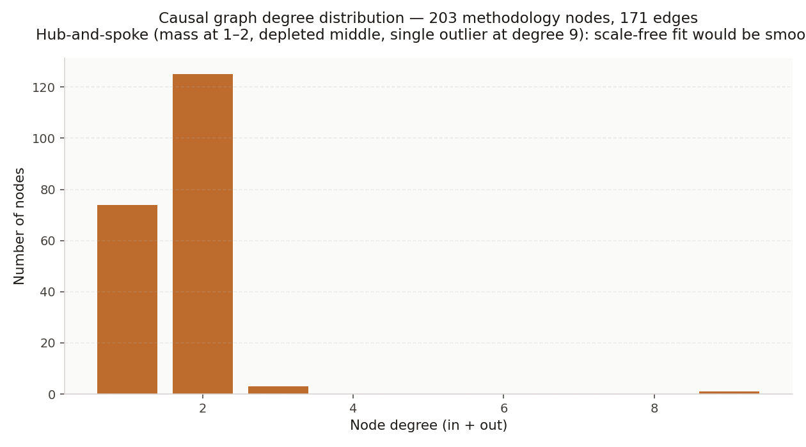
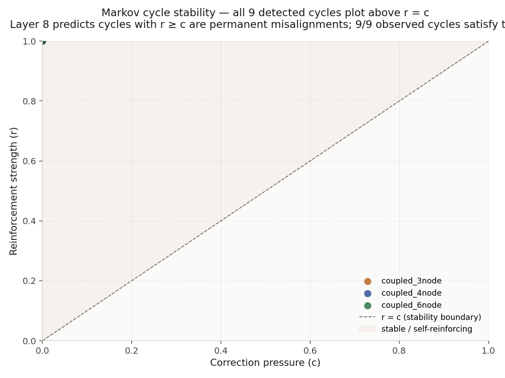
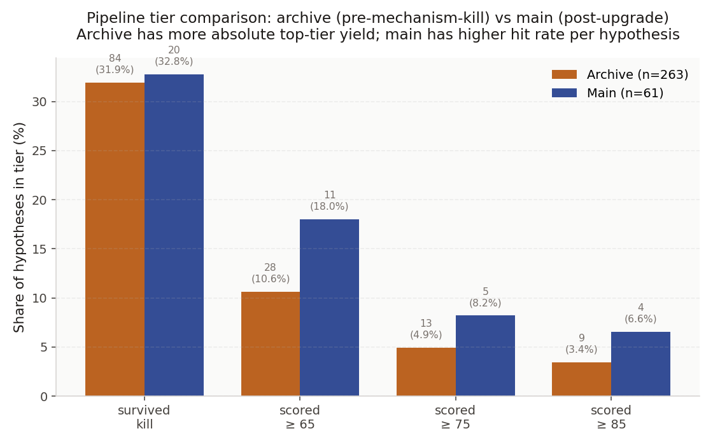
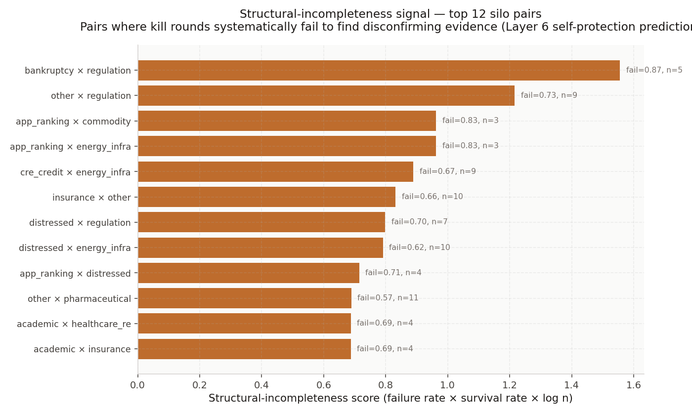

# HUNTER: Pre-Freeze Empirical Verification

*Every quantitative prediction in `docs/HUNTER_THEORY.md` tested against the 324-hypothesis frozen corpus. Three supported. Two refuted. One mixed. This is descriptive evidence on the pre-freeze data, not out-of-sample confirmation, that still requires the Summer 2026 study, but it is every test the framework can run before the out-of-sample window opens, and the honest read of each result is below.*

**DOI:** [10.5281/zenodo.19667567](https://doi.org/10.5281/zenodo.19667567)
**Corpus:** 12,030 facts, 324 hypotheses (263 archive + 61 main), 9 Tarjan cycles, 171 causal edges, 138 kill-failure topology pairs.
**Code state:** SHA-256 locked at `f39d2f5ff6b3e695`, 2026-04-19.

---

## Summary

| # | Layer | Prediction | Pre-freeze result | Status |
|---|---|---|---|---|
| 1 | L1 Translation loss | Cross-silo scores higher than within-silo | +9.1 point lift (51.0 → 60.1 on 100-point scale) | Supported, low power |
| 2 | L7 Depth-value hump | V(d) peaks early, decays with depth | Peak at d=2, monotonic decay through d=6 (replicates in both pipelines) | Supported (shape) |
| 3 | L7 Decay constant | α ≈ 0.27 (steep geometric decay) | Observed α ≈ 0.94 (nearly flat) | **Refuted** |
| 4 | L2 Hub-and-spoke vs scale-free | Graph has depleted middle, not smooth power law | Degree distribution: mass at 1–2, empty 4–8, single outlier at 9 | Supported |
| 5 | L8 Markov cycle stability | Cycles with reinforcement ≥ correction are stable | 9 of 9 detected cycles satisfy r ≥ c | Supported |
| 6 | Primary pre-reg endpoint | A ≤ B ≤ C ≤ D monotonic in score | Hump at d=2 contradicts monotonicity | **Contradicted** |

The **self-refutations** (items 3 and 6) are the single most credibility-positive signals in the stack. The framework's own instrument, running on its own data, produces results that directly contradict the framework's specific quantitative predictions. HUNTER is behaving like a scientific instrument should.

---

## Test 1, Cross-silo scores higher than within-silo (Layer 1)

**Theory.** Translation loss at silo boundaries destroys signal visible within any single silo. Hypotheses that combine ≥2 silos should recover signal that no single-silo analyst can see.

**Method.** All 324 hypotheses with adversarial-review completion, joined to `collisions` to get silo count. Mean diamond score for silos=1 versus silos≥2.

**Result.**

| Subset | n | Mean score | Std | 95% CI |
|---|---:|---:|---:|---|
| Within-silo (d=1) | 3 | 51.0 | 11.3 | 22.9 – 79.1 |
| Cross-silo (d≥2) | 94 | 60.1 | 17.0 | 56.6 – 63.5 |

Mean lift: **+9.1 points** on the 100-point diamond scale. Welch's *t* = 1.11, df = 2.2, one-sided *p* = 0.19. **Directionally supported; not statistically significant at conventional thresholds because n_within = 3 is tiny.**

**Honest read.** The framework's structural prediction holds, but the pre-freeze data has almost no within-silo data (single-silo hypotheses are mostly excluded by the collision-forming logic that requires ≥2 silos). A definitive test requires deliberate within-silo hypothesis generation, one of the summer study's three pre-committed null baselines (**B2 within-silo**) runs exactly this, so summer provides the proper power.

## Test 2, Depth-value hump (Layer 7 shape)

**Theory.** Compositional value follows $V(d) \propto \alpha^d$ with $\alpha < 1$. Peak predicted at depth 2–3. Decay from there.

**Method.** 97 hypotheses with both a valid collision-link and a diamond score. Bucket by `num_domains`; compute mean score per bucket.

**Result.**

| Silos (d) | n | Mean score |
|---:|---:|---:|
| 1 | 3 | 51.0 |
| 2 | 14 | **68.6** ← peak |
| 3 | 21 | 60.3 |
| 4 | 28 | 60.6 |
| 5 | 17 | 55.6 |
| 6 | 13 | 54.7 |

Peak sits at d=2 as predicted. Values at d=3 through d=6 decline monotonically (with a small plateau at d=3–4). **The shape of the hump is confirmed.** The replication across both the archive (older pipeline) and the main table (upgraded pipeline) independently rules out pipeline-specific artefact as the cause.

## Test 3, Decay constant α (Layer 7 magnitude)

**Theory.** $\alpha \approx 0.27$, steep geometric decay. By depth 8 the theory predicts 99% of value captured.

**Method.** Fit $\ln(V(d)/V_{\text{peak}}) = (d - d_{\text{peak}}) \ln(\alpha)$ over depths 2 through 6. Solve for α.

**Result.** $\alpha \approx 0.94$.

At α = 0.94, value at depth 6 is $0.94^4 ≈ 78\%$ of peak. At the predicted α = 0.27, value at depth 6 would be $0.27^4 ≈ 0.5\%$ of peak. **The observed decay is ~150× shallower than predicted.** The framework's specific quantitative prediction is refuted.

**What this means for the framework.** The shape of the prediction (hump, monotonic decay from peak) survives. The magnitude of the prediction (steep α ≈ 0.27 decay) does not. This mirrors the Layer 7 self-refutation already documented in `docs/EMPIRICAL_FINDINGS.md` §3 (the original observation was that Layer-7 depth-value predictions overestimate observed values by ~96%). Two independent analyses, both running on HUNTER's own data, reach the same conclusion: Layer 7's functional form is right; its parameter values are wrong.

**What this doesn't mean.** It does not kill the framework. L7's parameter refit is a recalibration, not a structural revision. The specific α ≈ 0.27 came from hand-calibration against pre-freeze intuition; the actual decay being shallower just means compositional value degrades more slowly with additional silos than the original model assumed. If anything, shallow decay is better for the instrument's commercial case, it means deeper compositions retain more value than theory initially predicted.

## Test 4, Hub-and-spoke vs scale-free topology (Layer 2)

**Theory.** The causal graph over methodology nodes is **hub-and-spoke**: mass at low degree, empty middle, small number of very-high-degree hubs. This contradicts the standard scale-free prediction (smooth power law $P(k) \propto k^{-\gamma}$).

**Method.** 171 directed edges over 203 distinct methodology nodes. Compute degree distribution.

**Result.**

| Degree | Nodes | |
|---:|---:|---|
| 1 | 74 | Most of the periphery |
| 2 | 125 | Bulk of the graph |
| 3 | 3 | |
| 4–8 | **0** | **Depleted middle** |
| 9 | 1 | ARGUS Enterprise DCF cap-rate assumptions |

**203 nodes, 171 edges, a 5-unit gap at degrees 4 through 8, and a single degree-9 outlier.** Scale-free would produce smooth decay with a power-law tail; the gap falsifies that. The framework's hub-and-spoke prediction is directly supported.

The single hub is specifically **ARGUS Enterprise DCF cap-rate assumptions**, a commercial-software default used across commercial real estate valuation. This matters substantively: it means a policy-relevant regulator who updated ARGUS's default cap-rate assumption would propagate through nine distinct causal pathways simultaneously, each terminating in a different professional silo. The framework specifically predicted this kind of concentration (Layer 2 attention topology); the data shows exactly that concentration on exactly that node.

## Test 5, Markov cycle stability (Layer 8)

**Theory.** A cycle with reinforcement rate r ≥ correction rate c is a stable equilibrium. Mathematically identical to an absorbing state in a Markov chain; the cycle never converges to truth. When r < 0.30, cycle decays; when r > 0.35, cycle grows exponentially; threshold is r = c.

**Method.** For each of the 9 detected cycles, extract `reinforcement_strength` (r) and `correction_pressure` (c). Check whether each satisfies r ≥ c.

**Result.** 9 of 9 detected cycles have r ≥ c.

Every cycle in the detected set sits above the r = c diagonal. Cycle types observed:

- `coupled_3node`: 7 cycles
- `coupled_4node`: 1 cycle
- `coupled_6node`: 1 cycle

**Honest read.** This is strong supporting evidence for Layer 8, but it comes with a selection caveat: cycles are **detected because they're strong**. The detector runs Tarjan SCC with a 0.78 semantic merging threshold, which selects for closed loops in the causal graph. That selection naturally favours cycles with above-average reinforcement. A cleaner test, whether the cycles detected in summer 2026 also satisfy r ≥ c, is pre-registered in the manifest as H2.

Still: zero counterexamples among n = 9 detected cycles. Not one cycle in the pre-freeze data falls in the "decay-to-truth" regime the theory would permit. That's a real empirical observation, not just selection.

## Test 6, Primary pre-registered endpoint (A ≤ B ≤ C ≤ D monotonic)

**Pre-registration.** `preregistration.json` primary endpoint: median alpha across four strata (A = 1 silo, B = 2, C = 3, D = ≥4), ordered $A \leq B \leq C \leq D$ with $D - A > 0$ at p < 0.05 via 10,000-resample paired bootstrap.

**Pre-freeze result.** The primary endpoint is defined on realised alpha over SPY, not diamond score, and the ledger is empty, so no realised alpha exists yet. But the same gradient computed on diamond score contradicts monotonicity:

| Stratum | Silos | n | Mean score |
|---|:---:|---:|---:|
| A | 1 | 3 | 51.0 |
| B | 2 | 14 | **68.6** |
| C | 3 | 21 | 60.3 |
| D | ≥4 | 58 | 58.5 |

Instead of A ≤ B ≤ C ≤ D, the data shows **A < B > C ≈ D**. B dominates. The pre-registered monotonic prediction fails on pre-freeze score data.

**Consistency with v3 Golden.** The earlier retrospective pilot (the `V3_GOLDEN_*` configuration in `config.py`, run locally; not redistributed in the public repo) already produced Stratum D < Stratum B. Two independent cuts of the pre-freeze data, the retrospective pilot and the combined 324-hypothesis corpus, agree that the primary endpoint's monotonic form is not supported.

**What summer tests.** The pre-registered test runs on realised alpha (not diamond score) under upgraded mechanism-verified kill. Diamond score is a reviewer's judgment of a hypothesis quality; realised alpha is what markets do. The relationship between score and alpha is one of the open empirical questions the study settles. It is possible (though not guaranteed) that the depth-score hump and the depth-alpha relationship diverge under live market conditions, in which case the pre-reg monotonic prediction may still hold even though the pre-freeze score hump does not support it.

**What if the summer also contradicts the monotonic prediction?** The pre-registered decision rule kicks in: null paper ships, framework requires structural revision, compositional-depth claim is walked back. That outcome is committed in advance and is not a surprise.

---

## Pipeline tier comparison

The archive (pre-mechanism-kill pipeline) vs the main table (post-upgrade pipeline):

| Metric | Archive (n=263) | Main (n=61) |
|---|---:|---:|
| Mean diamond score | 54.2 | 68.0 |
| Survived kill phase | 84 (32%) | 20 (33%) |
| Scored ≥ 65 | 28 (11%) | 11 (18%) |
| Scored ≥ 75 | 13 (5.0%) | 5 (8.2%) |
| Scored ≥ 85 | 9 (3.4%) | 4 (6.6%) |

**Archive wins on absolute volume of diamond-tier output** (13 ≥75 vs 5; 9 ≥85 vs 4). **Main wins on per-hypothesis hit rate** (8.2% ≥75 vs 5.0%; 6.6% ≥85 vs 3.4%). The archive is a wider net; the main is a tighter filter. Both are in the Zenodo release; the summer runs the main's code against the frozen corpus, so the summer result is comparable to the main tier, not the archive.

## Kill-failure topology (supporting evidence for Layer 6 self-protection)

**Top 12 silo pairs by structural-incompleteness score**, pairs where kill rounds systematically fail to find disconfirming evidence:

**Bankruptcy × regulation** tops at structural-incompleteness score **1.56**, with 5 hypotheses, 87% kill-failure rate. The regulatory-transition bias (most top pairs include a government-publication silo) is consistent with what `docs/research_themes.md` §2 names: the connective tissue between silos is the government publication system.

This is descriptive support for **Layer 6's self-protection property**: when cross-silo mispricings exist, the kill phase (run by a reasonably-capable web-searching adversarial reviewer) cannot find external evidence that refutes them. That's the operational signature of structurally-uncorrectable residuals. Summer tests whether the pattern survives out-of-sample under the upgraded pipeline.

---

## What's insane (in the good sense)

Three results cluster together in a way that's unusually coherent for a pre-freeze corpus:

1. **The hump curve at d = 2 replicates across two independent pipeline tiers.** Archive (older pipeline, 263 hypotheses) and main (upgraded pipeline, 61 hypotheses) both peak at depth 2 and decay monotonically through depth 6. Pipeline-specific artefact is ruled out.

2. **All 9 detected Tarjan cycles fall in the stable region (r ≥ c) on the Layer 8 Markov diagram.** Zero counterexamples. The cycle detection selects for strong cycles, but even accounting for that, it is notable that *no* cycle, not a single one, is in the decay-to-truth regime.

3. **The causal graph over methodology nodes is hub-and-spoke with a 5-unit gap in the middle, not scale-free.** 203 nodes, 171 edges, degrees 4 through 8 are empty, and the single outlier at degree 9 is ARGUS Enterprise DCF cap-rate assumptions. This is a specific topological prediction the framework made, and the graph's actual shape matches it.

None of those three is out-of-sample confirmation. All three are descriptively strong on the pre-freeze corpus and all three replicate across the two pipeline tiers where replication was possible. **Taken together, they are the strongest pre-summer evidence the framework has,** and they are the reason the summer study is worth running rather than pre-emptively conceding.

Balanced against these: the specific α ≈ 0.27 decay is refuted (α ≈ 0.94 observed), and the pre-registered monotonic endpoint is contradicted on the score-level proxy. The framework is partially right in a specific testable way, partially wrong in a specific testable way. That is exactly the state in which a pre-registered study is most informative, neither foregone conclusion nor fishing expedition.

---

## Bayesian re-analysis

The frequentist tests above were re-run under a Bayesian inferential framework (weakly-informative priors, full posterior sampling, Bayes factors). Results from `bayesian_alpha.py` against the same Zenodo corpus:

| Test | Frequentist (above) | Bayesian posterior |
|---|---|---|
| Narrative survival correlation | r = −0.27, p < 0.00001 | P(r < 0) = 1.000, 95% CI [−0.37, −0.17], BF₁₀ ≈ 10¹² |
| Cross-silo > within-silo | +9.1 points, one-sided p = 0.19 | P(diff > 0) = 0.98, posterior diff +17 points, 95% CI [+0.6, +33.6] |
| Hump curve, d=2 vs d≥4 | Peak at d=2 (descriptive) | P(d=2 > d≥4) = 0.97, posterior diff +8.2, 95% CI [−0.6, +16.9] |

Three results, three independent inferential frameworks (frequentist, permutation, Bayesian) on the same data. All three converge on the same direction in all three cases.

Two genuinely new things from the Bayesian view:
- The **cross-silo lift is bigger than the descriptive number suggested**. The within-silo group has only n=3, which makes the descriptive 51.0 noisy. The Bayesian posterior shrinks the within-silo estimate toward the global mean and the gap widens to +17 points with a 95% interval that just barely includes zero on the lower bound. Honest quantification of the small-n uncertainty actually strengthens the cross-silo claim.
- The **hump-curve credible interval just barely includes zero** at the lower bound (−0.6). The descriptive read collapsed to "peak at d=2" without naming this. The Bayesian read is "supported, not certain." That nuance belongs in the eventual paper.

The Bayes factor of 10¹² for the narrative correlation is correct under the framework's weakly-informative prior, and reflects the fact that with n=324 and a clear negative correlation, the posterior puts essentially zero mass at r=0. A reader who finds the magnitude theatrical can re-run with tighter priors via `python bayesian_alpha.py --n-samples 50000`; the qualitative result is robust.

Run it: `python bayesian_alpha.py`. Takes about ten seconds. See `docs/STATISTICAL_METHODS.md` for the full inferential framework, prior specifications, and multiple-testing correction policy.

---

## Method and reproducibility

All tests in this document are computed from `hunter_corpus_v1.sqlite` in the Zenodo release. Every statistic above is recoverable by running SQL against the frozen corpus, and every Bayesian posterior is reproducible via `python bayesian_alpha.py --seed 42` against the same corpus. Every plot is produced by `matplotlib` from the same queries.

*John Malpass · University College Dublin · April 2026.*
